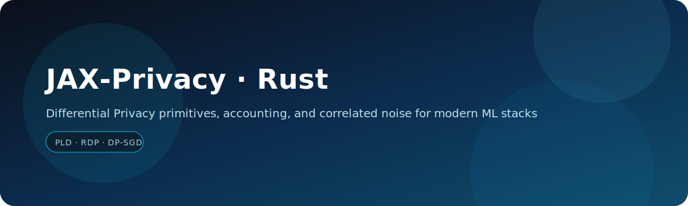

<p align="center">
  
</p>

<h1 align="center">JAX-Privacy · Rust</h1>

<p align="center">
  Differential Privacy primitives, accounting, and correlated noise for modern ML stacks.
</p>

<p align="center">
  <a href="https://github.com/staticpayload/jax-privacy-rs/actions/workflows/ci.yml">
    
  </a>
  
  
</p>

<p align="center">
  <a href="docs/index.md">Docs</a> ·
  <a href="crates/facade">Crate</a> ·
  <a href="crates/facade/examples">Examples</a> ·
  <a href="AGENTS.md">Architecture</a> ·
  <a href="CONTRIBUTING.md">Contributing</a>
</p>

---

## Inspired by JAX Privacy

<p>
  
  <strong>Inspired by Google DeepMind’s JAX Privacy.</strong>
  This Rust port is independent and <strong>not affiliated</strong> with Google or DeepMind.
</p>

---

## What is this?

This repository is a Rust rewrite of the JAX Privacy library. It provides production‑focused
building blocks for differentially‑private (DP) ML, with a framework‑agnostic core and
feature‑gated adapters for popular Rust ML ecosystems.

Key goals:
- Numerical equivalence with the reference JAX implementation where possible.
- A stable, composable DP core for Rust ML stacks.
- Clear APIs for privacy accounting, clipping, noise addition, and auditing.

## Features

- DP‑SGD primitives: clipping, aggregation, Gaussian/Laplace noise.
- Privacy accounting: RDP + discretized PLD (Gaussian + Poisson subsampling).
- Matrix factorization: Toeplitz, banded, streaming matrix utilities.
- Auditing utilities: membership inference and canary‑score auditing.
- Deterministic PRNG compatible with JAX‑style key splitting.
- PyTree‑equivalent trait and derive macro for structured tensors.

## Workspace layout

```
crates/
  facade/       # jax-privacy (re-exports)
  core/         # DP primitives, PyTree trait, clipping, noise, sampling
  prng/         # Stateless splittable RNG (JAX-compatible semantics)
  accounting/   # RDP/PLD accounting, calibration helpers
  mf/           # Matrix factorization + correlated noise
  audit/        # Auditing tools
  derive/       # #[derive(PyTree)] proc macro
  adapters/
    burn/       # Burn adapter (feature: burn)
    candle/     # Candle adapter (feature: candle)
    tch/        # tch-rs adapter (feature: tch)
```

## Installation

This crate is not yet published on crates.io. Use a local path or Git dependency.

### Local path

```
cargo add jax-privacy --path crates/facade
```

### Git (example)

```
[dependencies]
jax-privacy = { git = "<your-repo-url>", package = "jax-privacy" }
```

## Quickstart

```rust
use jax_privacy::accounting::dpsgd_event;

fn main() {
    let steps = 1000;
    let sampling_prob = 0.01;
    let noise_multiplier = 1.2;
    let delta = 1e-6;

    let eps = dpsgd_event(noise_multiplier, steps, sampling_prob).epsilon(delta);
    println!("epsilon: {eps}");
}
```

More runnable examples are in `crates/facade/examples`:

```
cargo run -p jax-privacy --example basic_dpsgd
cargo run -p jax-privacy --example privacy_accounting
cargo run -p jax-privacy --example canary_audit
```

## Documentation

See `docs/` for the Rust‑specific overview, installation notes, and library design.

## Reproducing Results

This Rust port focuses on core DP primitives and accounting. Research pipelines and
paper reproduction scripts remain in the original JAX repository. We provide Rust
examples and benchmarks as a starting point for replication.

## Citing

If you use this repository, please cite both the original JAX Privacy project and
this Rust port. See `CITATION.cff`.

## License

GNU General Public License v3.0. See `LICENSE`.

## Attribution

DeepMind logo is sourced from Wikimedia Commons. This project is not affiliated
with Google or DeepMind.

## Disclaimer

This is not an official Google product.
